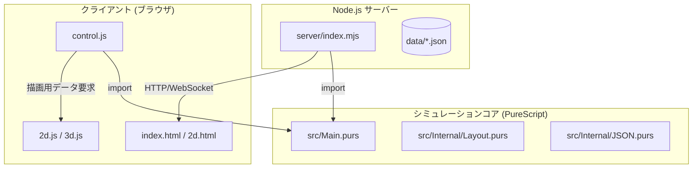

# prail/purs アーキテクチャ解説書 (ARCHITECTURE.md)

本ドキュメントでは、PureScript で実装された鉄道模型レイアウトシミュレータ `prail` の全体像、ディレクトリ構造、主要コンポーネント、およびデータフローについて解説します。開発時の理解やデバッグのガイドとして活用してください。

---

## 1. 全体像と技術スタック

本リポジトリは、鉄道シミュレータのシミュレーションロジック（PureScript）と、同期サーバー（Node.js / Express + Socket.IO）、およびクライアント描画・UI（HTML/CSS/JS）の3つのレイヤーで構成されています。



- **シミュレータコア (PureScript)**
  - トランスパイラ `purs-backend-es` を使用してESモジュール形式のJavaScriptモジュール（`server/docs/main.js`）へとコンパイル・バンドルされます。
- **同期サーバー (Node.js)**
  - `server/index.mjs` が稼働し、Socket.IO によるリアルタイム状態同期とセーブデータのファイル永続化を行います。
- **クライアント (HTML/CSS/Vanilla JS)**
  - Three.js / Canvasを使用した 3D / 2D 描画を行い、ユーザーの操作（ポイント切替や列車速度変更など）を受け付けます。

---

## 2. ディレクトリ構造と主要ファイル

主要なソースコードおよびアセットの配置場所と役割は以下の通りです。

```
prail/purs/
├── .agents/
│   └── AGENTS.md           # AIアシスタント向けの開発ルール・ガイドライン
├── ARCHITECTURE.md         # 本ファイル（全体アーキテクチャ解説）
├── build.sh                # PureScriptビルド＆JavaScriptバンドルスクリプト
├── spago.yaml              # Spago パッケージマネージャの設定
├── src/                    # PureScriptソースコード
│   ├── Main.purs           # エントリーポイント。JS側へエクスポートするAPI群を定義
│   └── Internal/
│       ├── Types.purs      # 基本的な座標や角度、レールの共通型定義
│       ├── Rails.purs      # 各種レールの定義、座標計算、分岐器（ポイント）などの形状ロジック
│       ├── JSON.purs       # 状態データのエンコード/デコード処理 (シリアライズ)
│       └── Layout/         # シミュレータのコアロジック
│           ├── Types/      # 内部状態（Layout, Signal, Train等）のレコード定義
│           ├── Tick.purs   # 毎フレームの状態進行処理（位置移動、閉塞判定、信号変化等）
│           ├── TrainMovement.purs # 列車の加減速、停止位置、ブレーキパターン計算
│           ├── SignalLogic.purs   # 信号の閉塞・連動制御、進路変更処理
│           ├── Operation.purs     # レール・信号・列車の追加/削除など、レイアウト状態の動的編集
│           └── DrawInfo.purs      # クライアントが描画するための各種属性（位置、方向、色）の算出
└── server/                 # Node.js サーバー＆クライアントアセット
    ├── index.mjs           # Express + Socket.IO サーバの本体
    └── docs/               # 静的Webコンテンツ（クライアント側アプリ）
        ├── index.html      # 3D描画用HTML
        ├── 2d.html         # 2D描画用HTML
        ├── control.js      # PureScript APIとクライアントUIを繋ぐコントローラ層
        ├── 2d.js / 3d.js   # 2D Canvas / 3D Three.js による描画ロジック
        ├── load.js         # 通常モード（ローカル用）のUI制御および初期ロード・イベントハンドラ
        ├── main.js         # 【自動生成】PureScriptからビルド・バンドルされたJS成果物
        └── online/
            └── load.js     # オンラインモード（Socket.IO同期用）のUI制御・イベントハンドラ
```

---

## 3. 主要な状態定義とデータモデル

シミュレータの状態データは、[Layout.purs](src/Internal/Layout/Types/Layout.purs) の `Layout` レコードに集約されています。

### 3.1. `Layout` レコード
`Layout` はシミュレータにおける世界の全状態を保持します。
- `rails`: マップに配置されたすべてのレール（`RailNode`）を保持するマップ。
- `trains`: 走行している全編成（`Trainset`）の配列。
- `signalcolors`: 信号機の現示状態。
- `routequeue`: 開通待ちの進路要求キュー。

### 3.2. `Trainset` レコード
列車の状態を保持するレコード（[Train.purs](src/Internal/Layout/Types/Train.purs)）。
- `route`: 列車が現在占有または進路を確保しているレール経路の配列。
- `speed` / `notch`: 現在の速度および加速ノッチ。
- `distanceToNext`: 次の進路境界または停止位置までの残りの距離。
- `tags`: 列車の自動制御などで使われるタグ情報。

### 3.3. `RailNode` レコード
敷設された個々のレールを表すデータ（[RailNode.purs](src/Internal/Layout/Types/RailNode.purs)）。
- `joints`: レール接合点（他のレールとの接続関係）。
- `state`: レール内の分岐器（ポイント）などの開通状態。
- `isclear`: レール上に列車がいないかどうかのフラグ。
- `traffic`: 各接続口における閉塞および予約（Reserve）の占有状態。

---

## 4. データ同期フロー (Dataflow)

シミュレーション状態の同期と保存は、以下のライフサイクルに従って行われます。

```
[クライアント操作 (キー入力等)]
       │ (WebSocket: "key")
       ▼
[サーバー: index.mjs (OnlineControler.onkey)]
       │ 1. P.layoutUpdate (状態の反映)
       │ 2. L.tick(4.0)    (定期的な状態進行)
       ▼
[シミュレータ状態の更新] ─── (定期セーブ/ディスク書込) ───► [data/data_*.json]
       │
       │ P.encodeLayout (JSON.purs) によるシリアライズ
       ▼
[サーバーから全接続クライアントへ一斉送信] (WebSocket: "sync")
       │
       ▼
[クライアント: control.js (L.loadfrom)]
       │
       ▼
[描画の更新 (2d.js / 3d.js)]
```

### 4.1. 通常モードとオンライン同期モードの挙動の差異

シミュレータの動作モード（通常/オンライン）は、読み込まれる `load.js` によって制御の受け渡し方法が異なります。

- **通常モード ([load.js](server/docs/load.js))**:
  - キー入力（`document.onkeydown`）や lil.GUI のコントローラー操作イベントは、直接クライアント上のローカルインスタンス（`L.onkey`）に適用されます。
  - 作例（Presets）の読み込みやローカルファイルのアップロードは、ブラウザ内のJS処理として完結し、サーバーを介さずに読み込まれます。
- **オンライン同期モード ([online/load.js](server/docs/online/load.js))**:
  - `L.setSyncMethod` に登録されたコールバックを通じ、キー入力や操作イベントはすべて WebSocket（`socket.emit("key", ...)`）経由でサーバー（`server/index.mjs`）へ転送されます。
  - サーバーは受信したキー入力を処理して状態を変化させ、最新の状態を `fflate` で圧縮した上で、全接続クライアントに一斉配信（`sync`）します。
  - クライアントは `sync` を受信すると、受け取ったペイロードを展開して `L.loadfrom` で読み込み、描画を更新します。